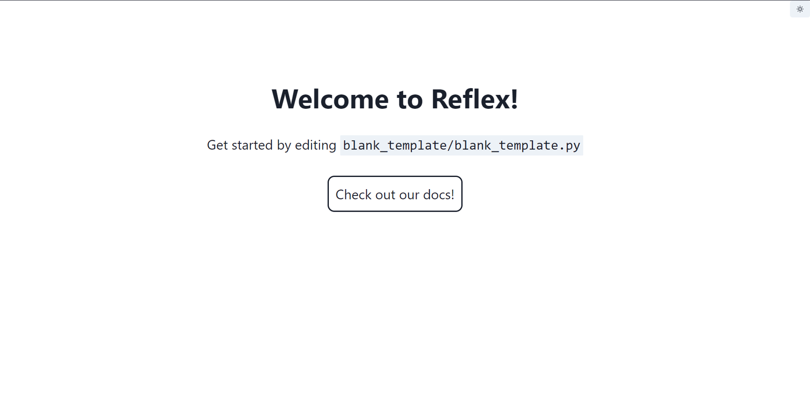
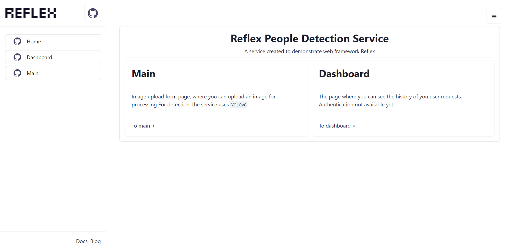

# Reflex Tutorial

Created: December 25, 2023 5:38 PM
Tags: Documentation
Completion : 80
Last edited by: January 10, 2024 1:55 PM

Не секрет, что програмисты, и тем более ML инжениры, которым важно и интересно работать над алгоритмамы, данными, моделами, страшен момент когда надо сделать MVP с веб-интерфейсом, потому что придется взаимодействовать с HTML, CSS, и JS. 

Если это звучало знакомо, то пришлашаю вас присоединиться к клубу хейтеров классического стека веб-разработки, и познакомиться с фреймворком Reflix!   

Reflix - это мощный фреймворк Python, который используется для создания веб-приложений. Он предлагает широкий спектр функций, которые делают разработку приложений быстрой и эффективной. С помощью Reflix, разработчики могут легко работать с базами данных, создавать интерактивные формы, управлять сессиями пользователей и многое другое. Благодаря своей гибкости и мощности, Reflix стал одним из самых популярных фреймворков Python для веб-разработки.

# Getting started

Опять же, это все только на чистом Python, и как все библиотеки Python, начинаем с установки пакетов

```python
pip install reflex
```

Дальше, с помощью команду init, мы можем создать шаблоную дирокторию для нашего приложения

```python
reflix init
```

После этого, предлагается выбирать шаблон, на данный момент есть два:

**Минимальный** 



**С панаелом навигации**



Будем работать с вторым шаблоном, потому что звучит круче. После выбора шаблона, наша директория должна выглядить вот таким образом: 

```bash
├── README.md
├── assets
├── rxconfig.py
└── Reflix
    ├── __init__.py
    ├── components
    │   ├── __init__.py
    │   └── sidebar.py
    ├── pages
    │   ├── __init__.py
    │   ├── index.py
    │   └── settings.py
    ├── state.py
    ├── styles.py
    ├── templates
    │   ├── __init__.py
    │   └── template.py
    └── Reflix.py
```

Ps. В моем случае название приложения — `Reflix` при создании приложение, фреймворк определяет название по названию корневой папки.

Осталось попробовать запускать приложение, для этого достаточно вводить команду:

```python
reflex run
```

Приложение запустится по адресу [http://localhost:3000](http://localhost:3000/)

# Разделы приложения

Пусть данный проект будет сервисом для детекций людей на изображении.

В проекте сейчас имеется две страницы — `index`, `~~dashboard~~`, `settings`. Поменяем назначения страниц:

- `index` — ленидинг для нашего приложения, где расскажем что за проект, и про страницы и функционал
- `settings`переименуем в `main` — страница где будет основонй функционал, там будет форма для запроса, и там пользователь получит список песен
- `~~dashboard` — страница где отображается история запросов.~~

## Лендинг страница

Начинаем с настройки страницы `index` она сейчас выглядит так:

```python
"""The home page of the app."""

from Reflix import styles
from Reflix.templates import template

import reflex as rx

@template(route="/", title="Home", image="/github.svg")
def index() -> rx.Component:
    """The home page.

    Returns:
        The UI for the home page.
    """
    with open("README.md", encoding="utf-8") as readme:
        content = readme.read()
    return rx.markdown(content, component_map=styles.markdown_style)
```

Можно заметить очень интересную фичу, с помощью `rx.markdown` можно загрузить свой файл формата `markedown`, но это слишком просто делается, поэтому будем попробовать работать с компанентами reflex. 

- heading — элемент `<h2>` в html, внутри его кроме текста, можно добавить другие элемент, например ссылки link.
    - параметр size — катагорический параметр `'lg' | 'md' | 'sm' | 'xs' | 'xl' | '2xl' | '3xl' | '4xl |` которые определяет размер.
- grid — контейнер html с классом grid, для настроки шаблона сетки.
    - Чтобы добавить эллемент сетки используется `grid_item`
        - Внутри `grid_item` можно передать любые под элементы, или `children`
        - `col_span & row_span` — колчиество стольбцов и строк, которые занимает элемент
    - `template_columns & template_rows` — общее количество стольбцов и строк сетки
        - Можно тоже использовать `auto_columns` и `auto_rows`, для автоматического определения распределения элементов сетки

***Ps. Болшенство компанентов `reflex` принимают `children`, которые являются под-элементами, например, ссылку внутри `text`***   

```python
"""The home page of the app."""

from Reflix.templates import template

import reflex as rx

@template(route="/", title="Home", image="/github.svg")
def index() -> rx.Component:
    """The home page.

    Returns:
        The UI for the home page.
    """

    return rx.vstack(
        rx.heading("Reflex People Detection Service", font_size="2em"),
        rx.text("A service created to demonstrate web framework ",
                rx.link("Reflex", href="https://reflex.dev/")),
        rx.divider(),
        rx.grid(
            rx.grid_item(
                rx.card(
                    rx.text(
                        "Image upload form page, where you can upload an image for processing\n "
                        "For detection, the service uses ",
                        rx.code("YOLOv8")),
                    header=rx.heading("Main", size="lg"),
                    footer=rx.link("To main >", href="/main", size="sm"),
                    size="md",
                    justify="space-between"
                ),
                row_span=1,
                col_span=1
            ),
            rx.grid_item(
                rx.card(
                    rx.text("The page where you can see the history of you user requests. "
                            "Authentication not available yet"),
                    header=rx.heading("Dashboard", size="lg"),
                    footer=rx.link("To dashboard >", href="/dashboard", size="sm"),
                    size="md",
                    justify="space-between"
                ),
                row_span=1, col_span=1),
            template_columns="repeat(2, 1fr)",
            h="100%",
            gap=4,
        )
    )
```

На данный момент, вот так выглядить лендинг страница


## Главная страница

Мы хотим чтобы на этой странице отображалась форма отправки фотографии и получение результатов. Для этого нужно pipeline, форма, и обработчик загруженных файлов 

### Pipeline

Для реализации детектора, создаем файл `pipelines/detection.py` и `pipelines/__init__.py` в папке нашего проекта, теперь наш проект выглядеть так: 

```bash
├── README.md
├── assets
├── rxconfig.py
└── Reflix
    ├── __init__.py
    ├── components
    │   ├── __init__.py
    │   └── sidebar.py
    ├── pages
    │   ├── __init__.py
    │   ├── dashboard.py
    │   ├── index.py
    │   └── settings.py
		│── pipelines
		│   ├── __init__.py
    │   └── detection.py
    ├── state.py
    ├── styles.py
    ├── templates
    │   ├── __init__.py
    │   └── template.py
    └── Reflix.py
```

В качестве модели детекции будем использовать `Yolov5s`, реализованную в `torch` . Это возможно не самый оптимальные и быстрый способ инференса, но для данного тоториала, кажется достаточно.

```python
# pipelines/detection.py

import torch

class YoloV5Detector:
    def __init__(self):
        super().__init__()
        self._load_model()

    def _load_model(self):
        self.model = torch.hub.load('ultralytics/yolov5', 'yolov5s')
        self.model.classes = [0]

    def save_predictions(self, img_path: str, path: str):
        predictions = self.model(img_path)
        return predictions.crop(save=True, save_dir=path)
```

И как мы все знаем, инициироватьмодель нужно один раз — при запуске приложения. Для этого в файл `__init__.py` создаем детектор, который будет обработать изображения и хранить детекции.

```python
# pipelines/__init__.py

from .detection import YoloV5Detector

detector = YoloV5Detector()
```

Функционал детекции должен быть в нашей главной странице, таким образом импортируем детектор в файле `main.py` 

```python
"""The main page."""

from Reflix.templates import template
import reflex as rx
from ..pipelines import detector # <--

...
```

### File upload form

Reflex снимает стресс создания веб-формы с нуля, в компоненте `Upload` даже реализованна функция *drag and drop.* По мимо `children` **у данного компанента, достаточно интересеные параметры:

- multiple — параметр`bool` который определяет возможность загрузки больше одного файла.
- accept — Список допустимых типов файлов. Это должен быть словарь типов MIME в качестве ключей и массив форматов файлов в качестве значений. поддерживаемые типы MIME: [https://developer.mozilla.org/en-US/docs/Web/HTTP/Basics_of_HTTP/MIME_types/Common_types](https://developer.mozilla.org/en-US/docs/Web/HTTP/Basics_of_HTTP/MIME_types/Common_types)
- border, padding — обычные CSS стили

### Upload handler

Чтобы сделать приложением интерактивным, Reflex имеет класс `State` и он, как можно понять по названию, описывает статус всего приложения, то есть переменные которые будут храниться в нем будут доступны во всех страницах приложения. Но при перегрузке страницы в браузере наш статус тоже перезагружается, поэтому хранить в нем важную информацию, конечно же неразумно

В классы `State` можно добавлять методы обработки событий, в нашем случае добавим метод `handle_upload` который вызывается при нажатии на кнопку `upload` 

Наш метод будет сохронять загруженные файлы, и затем вызывать метод детектора `save_predictions`, которая принимает путь к загруженному файлу, и путь к папку где будут сохранены результаты детекции. 

А хранить результаты будем в переменных класса `img` и `detects`. 

```python
"""The main page."""

from Reflix.templates import template
import reflex as rx
from ..pipelines import detector

class State(rx.State):
    """The app state."""

	img: list[str]
    detects: list[Image.Image]

    async def handle_upload(
            self, files: list[rx.UploadFile]
    ):
        """Handle the upload of file(s).

        Args:
            files: The uploaded files.
        """
        for file in files:
            upload_data = await file.read()
            outfile = f"media/{file.filename}"

            with open(outfile, "wb") as file_object:
                file_object.write(upload_data)

            detector.save_predictions(outfile, f"media/detections/{file.filename}/")
			detector.save_predictions(outfile, detects_path)
			detects = list(os.scandir(detects_path+"crops/person/"))

			self.img.append(file.filename)
            self.detects = [Image.open(src_path + d.name) for d in detects]

@template(route="/main", title="Main")
def main() -> rx.Component:
    """The main view."""
    return rx.vstack(
        rx.heading("Main page"),
        rx.text("Загрузите сюда фотографию для дитекции"),
        rx.upload(
            rx.vstack(
                rx.button(
                    "Select File",
                    bg="white",
                    border=f"1px solid",
                ),
                rx.text(
                    "Drag and drop files here or click to select files"
                ),
            ),
            multiple=False,
            accept={
                "image/png": [".png"],
                "image/jpeg": [".jpg", ".jpeg"],
            },
            border=f"1px dotted",
            padding="5em",
        ),
        rx.button(
            "Upload",
            on_click=lambda: State.handle_upload(
                rx.upload_files()
            ),
        ),
        rx.responsive_grid(
            rx.foreach(
                State.detects,
                lambda img: rx.vstack(
                    rx.image(src=img),
                  
                ),
            ),
            columns=[2],
            spacing="5px",
        ),
        padding="5em",
    )
```

## Dashboard

Теперь нужно хранить результаты обработки. Правильным подходом будет хранить их в базе данных, но это оставим на дальнейшее изучение. 

### Сохранение истории

Будем хранить историю запросов с помощью нашего класса `State` . Для этого создадим атрибут `history` , который будет представлять собой списком объектов `DetectionRequest`

```python
class DetectionRequest(TypedDict):
    datetime: str
    source: Image.Image
    detects: list[str]
```

При каждой загрузке добавим новый объект в нашу историю. Класс `State` так будет выглядеть. 

```python
class State(rx.State):
    """The app state."""

    # The images to show.
    img: list[str]
    detects: list[Image.Image]
    history: list[DetectionRequest]

    async def handle_upload(
            self, files: list[rx.UploadFile]
    ):
        """Handle the upload of file(s).

        Args:
            files: The uploaded files.
        """
        for file in files:
            upload_data = await file.read()
            outfile = f"media/{file.filename}"
            now = datetime.datetime.now()
            with open(outfile, "wb") as file_object:
                file_object.write(upload_data)

            detects_path = f"media/detections/{file.filename}/"
            detector.save_predictions(outfile, detects_path)
            detects = list(os.scandir(detects_path+"crops/person/"))

            src_path = f"media/detections/{file.filename}/crops/person/"

            self.img.append(file.filename)
            self.detects = [Image.open(src_path + d.name) for d in detects]
            self.history.append({
                "datetime": f"{now.day}.{now.month}.{now.year} {now.hour}:{now.minute}",
                "source": Image.open(outfile),
                "detects": [src_path + d.name for d in detects]
            })
            
```

### Отображение истории

Не будем создавать ещё один класс для статуса, как я сказал ранее, класс `State` доступен со всех страниц нашего приложения. То есть достаточно вызвать атрибут: `State.history`

```python
"""The dashboard page."""
from Reflix.templates import template
from .main import State
import reflex as rx

@template(route="/dashboard", title="Dashboard")
def dashboard() -> rx.Component:
    """The dashboard page.

    Returns:
        The UI for the dashboard page.
    """

    return rx.vstack(
        rx.heading("Dashboard", font_size="3em"),
        rx.text("Welcome to Reflex!"),
        rx.text(
            "You can edit this page in "),
        rx.code("{your_app}/pages/dashboard.py"),
        State.img,
        rx.vstack(
            rx.foreach(
                State.history,
                lambda request:
                rx.card(
                    rx.hstack(
                        rx.image(src=request["source"], width="100px", height="auto"),
                        rx.text(request["datetime"]),

                        header=rx.heading(request["datetime"], size="md"),
                        size="sm",
                    ),
                ),
            )
        ),
    )
```

## Summery

С помощью `Reflex` мы смогли написать веб-приложение, на чистом `python`. Реализовали загрузку и сохранение файлов, инференс модели Yolo, и функционал личного кабинета, остается подключение БД, например, `SQlite`, и у нас готовое надежное веб-решение. 

Стоит отметить что, имметь представление о `html` и `css`, достаточно полезно, по скольку логика стилей остается одной, но тут за нас все удобным образом организованно.  

# Resources

- Подключение базы данных в приложении `Reflex`
    
    [ORM Quick Start
     —
        SQLAlchemy 1.4 Documentation](https://docs.sqlalchemy.org/en/14/orm/quickstart.html)
    
    [Database Overview](https://reflex.dev/docs/database/overview/)
    
- Для рендеринга стилей компонентов, используется `CSS` библиотека
    
    [Documentation](https://tailwindui.com/documentation)